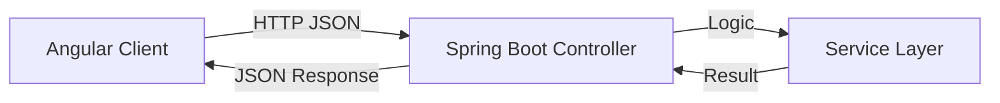

# 🧮 Modern Full-Stack Calculator


> A Windows-inspired calculator ensuring precision with a Spring Boot backend and a responsive Angular frontend.

---

## ⚡ Functionality Demo


*(Note: Replace the generic GIF above with a screen recording of your actual application!)*

---

## 🎨 Features

| Feature | Description | Status |
| :--- | :--- | :---: |
| **Standard Ops** | Addition, Subtraction, Multiplication, Division | ✅ |
| **Scientific Ops** | Square Root, Power, Logarithms | ✅ |
| **History Log** | View previous calculations in a scrollable side panel | ✅ |
| **Responsive UI** | Mimics the Windows 10/11 Calculator layout | ✅ |
| **API Security** | Input validation on the backend to prevent crashes | ✅ |

---

## 🛠️ Architecture

This project uses a **RESTful** architecture.


# Backend (Spring Boot)
Controller: Handles incoming REST requests (/api/calculate).

Service: Performs the BigDecimal math to ensure high precision.

CORS Config: Allows communication with the Angular localhost.

# Frontend (Angular)
Components: Modular design (Keypad, Display, History).

Services: HTTP Client service to talk to the Spring Boot API.

Styling: CSS Grid/Flexbox for the calculator layout.

## 🚀 How to Run
1. Backend Setup
Bash

cd backend
```mvn spring-boot:run
# Server starts at http://localhost:8080
```
2. Frontend Setup
Bash
```
cd frontend
npm install
ng serve
# UI starts at http://localhost:4200
```
## 👨‍💻 Author
# Mohamed Gomaa

    
